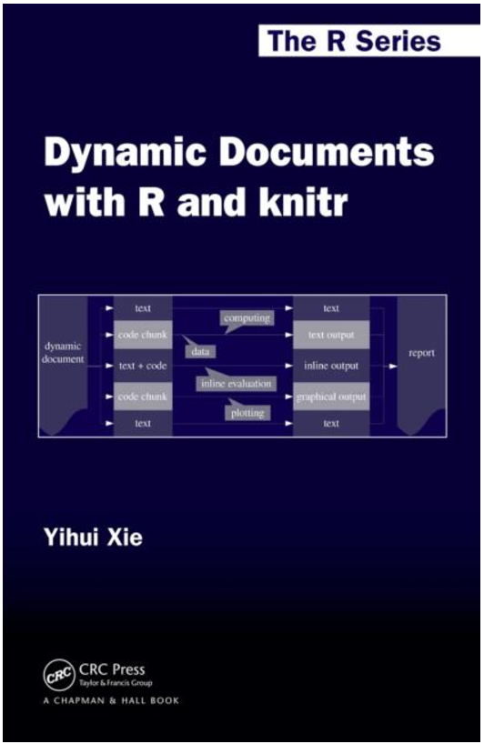
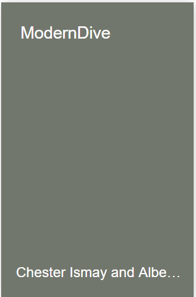
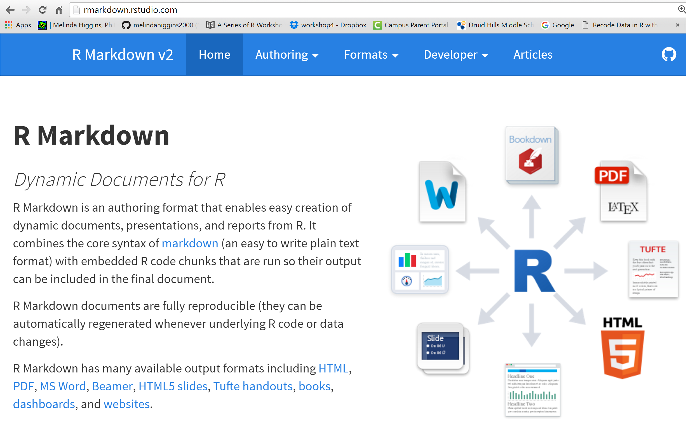

```{r setup, include=FALSE}
knitr::opts_chunk$set(echo = FALSE)
```

## Outline

* Reproducible Research
    - Timeline Reproducible Research & Transparency
    - Books
    
* The Big Picture

* Git and Github
    - Version Control and Tracking
    - Cloud Based Repository - files, code, sharing, collaboration

## Outline

* Literate Programming & Dynamic Documentation
    - Literate Programming - The `WEB` System
    - Dynamic Documentation - `SWEAVE`
    - The Next Generation - `knitr` + `rmarkdown`
    - Universal Document Converter - `Pandoc`
    - `Rmarkdown` "HUB"
    
* R and RStudio
    - Open Source
    - Interative Development Environment ("the hub")
    
* Templates
    - Code + Text = seamless production
    
## Timeline Reproducible Research & Transparency<footnote>Timeline partially based on PLOS Blog December 2016[http://blogs.plos.org/absolutely-maybe/2016/12/05/reproducibility-crisis-timeline-milestones-in-tackling-research-reliability/](http://blogs.plos.org/absolutely-maybe/2016/12/05/reproducibility-crisis-timeline-milestones-in-tackling-research-reliability/)</footnote>

YEAR | Event
:----|:--------------------------------------
**1992** | Jon Claerbout coined the term "reproducible research" in his book "EARTH SOUNDINGS ANALYSIS: Processing versus Inversion (PVI)" <footnote>[http://sepwww.stanford.edu/sep/jon/reproducible.html](http://sepwww.stanford.edu/sep/jon/reproducible.html)</footnote>
1996 | CONSORT statement introduced standards for reporting clinical trials <footnote>Begg C, Cho M, Eastwood S, Horton R, Moher D, Olkin I, Pitkin R, Rennie D, Schulz KF, Simel D, Stroup DF (1996). Improving the quality of reporting of randomized controlled trials. The CONSORT statement. JAMA 276:637-639.</footnote>
2004 | International Committee of Medical Journal Editors (ICMJE) stated they would not publish a clinical trial that had not been registered. <footnote>[http://www.icmje.org/news-and-editorials/update_2005.html](http://www.icmje.org/news-and-editorials/update_2005.html)</footnote>
2005 | Ioannidis, J. P. A. Why most published research findings are false. PLoS Med. 2, e124 (2005) <footnote>[https://doi.org/10.1371/journal.pmed.0020124](https://doi.org/10.1371/journal.pmed.0020124)</footnote>

## Timeline Reproducible Research & Transparency

YEAR | Event
:----|:--------------------------------------
2007 | FDA Amendments Act (FDAAA) required more types of clinical trials to be registered (final rules took effect January 2017) <footnote>[https://clinicaltrials.gov/ct2/manage-recs/fdaaa](https://clinicaltrials.gov/ct2/manage-recs/fdaaa)</footnote>
**2009** | Journal of Biostatistics institutes policy to work with authors to publish articles that meet a standard of reproducibility.<footnote>[https://academic.oup.com/biostatistics/article/10/3/405/293660/Reproducible-research-and-Biostatistics](https://academic.oup.com/biostatistics/article/10/3/405/293660/Reproducible-research-and-Biostatistics) & [https://academic.oup.com/biostatistics/pages/General_Instructions](https://academic.oup.com/biostatistics/pages/General_Instructions)</footnote>
2011 | Alsheikh-Ali, et.al. (2011), report the low percentage of researchers satisfying the policies regarding the availability and sharing of their data.<footnote>Alsheikh-Ali, A. A., Qureshi, W., Al-Mallah, M. H. & Ioannidis, J. P. Public availability of published research data in high-impact journals. PloS ONE 6, e24357, 2011; [https://doi.org/10.1371/journal.pone.0024357](https://doi.org/10.1371/journal.pone.0024357)</footnote>

## Cancer Testing Falls Apart {.centered}

<div class="columns-2">


</div>
[http://www.nytimes.com/2011/07/08/health/research/08genes.html](http://www.nytimes.com/2011/07/08/health/research/08genes.html)

2010 Video Presentation by Keith A. Baggerly [http://videolectures.net/cancerbioinformatics2010_baggerly_irrh/](http://videolectures.net/cancerbioinformatics2010_baggerly_irrh/)

## The Excel-Error Heard Around the World {.centered}


[https://newrepublic.com/article/112951/rogoff-reinhart-and-world-excel-error-research](https://newrepublic.com/article/112951/rogoff-reinhart-and-world-excel-error-research)

## Wide-Spread Gene Name Errors {.centered}


[https://genomebiology.biomedcentral.com/articles/10.1186/s13059-016-1044-7](https://genomebiology.biomedcentral.com/articles/10.1186/s13059-016-1044-7)

## Books on Reproducibility and Tools of the Trade {#myImagePage}

Image         | Book
:------------:|:--------------------------------------
 | Implementing Reproducible Research by Victoria Stodden, Friedrich Leisch, Roger D. Peng [https://www.crcpress.com/Implementing-Reproducible-Research/Stodden-Leisch-Peng/p/book/9781466561595](https://www.crcpress.com/Implementing-Reproducible-Research/Stodden-Leisch-Peng/p/book/9781466561595)
 | Dynamic Documents with R and knitr (Chapman & Hall/CRC The R Series) 1st Edition by Yihui Xie [https://www.crcpress.com/Dynamic-Documents-with-R-and-knitr/Xie/p/book/9781482203530](https://www.crcpress.com/Dynamic-Documents-with-R-and-knitr/Xie/p/book/9781482203530)
 | bookdown: Authoring Books and Technical Documents with R Markdown by Yihui Xie [https://www.crcpress.com/bookdown-Authoring-Books-and-Technical-Documents-with-R-Markdown/Xie/p/book/9781138700109](https://www.crcpress.com/bookdown-Authoring-Books-and-Technical-Documents-with-R-Markdown/Xie/p/book/9781138700109) & read online [https://bookdown.org/yihui/bookdown/](https://bookdown.org/yihui/bookdown/)

## more books {#myImagePage}

Image         | Book
:------------:|:--------------------------------------
 | Happy Git and GitHub for the useR by Jenny Bryan; read online [http://happygitwithr.com/](http://happygitwithr.com/)
 | Using R and RStudio for Data Management, Statistical Analysis, and Graphics, Second Edition by Nicholas J. Horton &  Ken Kleinman [https://www.crcpress.com/Using-R-and-RStudio-for-Data-Management-Statistical-Analysis-and-Graphics/Horton-Kleinman/p/book/9781482237368](https://www.crcpress.com/Using-R-and-RStudio-for-Data-Management-Statistical-Analysis-and-Graphics/Horton-Kleinman/p/book/9781482237368); also see [Project MOSAIC, http://mosaic-web.org/](http://mosaic-web.org/)
 &  | ModernDive: An Introduction to Statistical and Data Sciences via R by Chester Ismay and Albert Y. Kim; read online [https://ismayc.github.io/moderndiver-book/](https://ismayc.github.io/moderndiver-book/) & Getting used to R, RStudio, and R Markdown by Chester Ismay [https://ismayc.github.io/rbasics-book/](https://ismayc.github.io/rbasics-book/)
.              | ... and lots more ... see [https://bookdown.org/](https://bookdown.org/)

## The Big Picture {#bigpic}


## The Big Picture {#bigpic}


##  What is GIT??

* [https://git-scm.com/](https://git-scm.com/)

**GIT** is a widely used source code management system for software development. It was designed and developed in 2005 by Linux kernel developers (e.g. Linus Torvalds) for Linux kernel development. 

**GIT** is a distributed version control system with complete history & version-tracking capabilities. [Other version control systems you may have heard of are Subversion, CVS, Perforce, and ClearCase] 

**GIT** is FREE & distributed under the terms of the GNU General Public License version 2. More @  [https://git-scm.com/](https://git-scm.com/)

##  What is Github??

* [https://github.com/](https://github.com/)

**Github** is web-based **GIT** repository hosting service. It offers all of the distributed revision control and source code management (SCM) functionality of Git as well as adding its own features - for example, native interpretation of [*markdown*](https://daringfireball.net/projects/markdown/) which is MUCH easier to code/write than HTML - very lightweight code for creating documents.

**Github**, unlike Git, which is strictly a command-line tool, GitHub provides a Web-based graphical interface and desktop as well as mobile integration. **Github** provides access control and collaboration features such as bug tracking, feature requests, task management, and wikis for every project.

## The Big Picture {#bigpic}


## The `WEB` System by Donald Knuth

The first published literate programming environment was `WEB`. Donald Knuth introduced it back in 1981 combining his TeX typesetting system with the Pascal programming language.


<div class="quote-container2">

> _"I chose the name `WEB` partly because it was one of the few three-letter words of English that hadn’t already been applied to computers. But as time went on, I’ve become extremely pleased with the name, because I think that a complex piece of software is, indeed, best **regarded as a web that has been delicately pieced together from simple materials**. ... If we **express a program as a web of ideas**, we can emphasize its structural properties in a natural and satisfying way."_<footnote>http://www.literateprogramming.com/knuthweb.pdf</footnote>

</div>

## Funnel Web Tutorial Manual by Ross N. Williams

There are various implementations of the literate programming concept, one of which is Funnel Web by Ross N. Williams


<div class="quote-container2">

> _"A traditional computer program consists of a **text file containing program code**. Scattered in amongst the program code are comments which describe the various parts of the code._

> _In literate programming the emphasis is reversed. Instead of writing code containing documentation, the literate programmer writes **documentation containing code**. ... **The "program" then becomes primarily a document directed at humans**, with the code being herded between "code delimiters" from where it can be extracted and shuffled out sideways to the language system by literate programming tools."_<footnote>[http://www.literateprogramming.com/fwtut.pdf](http://www.literateprogramming.com/fwtut.pdf)</footnote>

</div>

## `SWEAVE` by Friedrich Leisch


<div class="quote-container2">

> What is Sweave?

> _"Sweave is a tool that allows to embed the R code for complete data analyses in latex documents. The purpose is to create dynamic reports, which can be updated automatically if data or analysis change. Instead of inserting a prefabricated graph or table into the report, the master document contains the R code necessary to obtain it. When run through R, all data analysis output (tables, graphs, etc.) is created on the fly and inserted into a final latex document. The report can be automatically updated if data or analysis change, which allows for truly reproducible research."_<footnote>Friedrich Leisch. Sweave: Dynamic generation of statistical reports using literate data analysis. In Wolfgang Härdle and Bernd Rönz, editors, Compstat 2002 - Proceedings in Computational Statistics, pages 575-580. Physica Verlag, Heidelberg, 2002. ISBN 3-7908-1517-9.</footnote>

</div>

## The next evolution `<- knitr`

<div class="columns-2">

<div class="centered">
 
</div>

In 2012 Yihui Xie, created and released the `knitr` package for R to extend the capabilities of `SWEAVE` beyond LaTeX.

</div>

<div class="quote-container2">

> _"The **knitr** package was designed to be a transparent engine for dynamic report generation with R, solve some long-standing problems in Sweave, and combine features in other add-on packages into one package."_<footnote>[https://yihui.name/knitr/](https://yihui.name/knitr/)</footnote>

</div>

## The next evolution `<- ... + rmarkdown`

<div class="centered">
 
</div>

* In 2014, RStudio released `rmarkdown` to extend the `markdown` language originally intended to write documents for the "web" _(i.e. HTML)_.<footnote>[https://daringfireball.net/projects/markdown/syntax](https://daringfireball.net/projects/markdown/syntax)</footnote> 

* `rmarkdown` leverages `Pandoc` _("universal document converter")_ <footnote>[http://pandoc.org/index.html](http://pandoc.org/index.html)</footnote> to convert between formats: from HTML (readable by web browsers) to DOC (such as from Microsoft Word or Google Docs) to ODT (Libre Office) to PDF (portable document format) to others like EPUB (e-books), HTML5 slide shows (slidy, ioslides), and TeX based documents and slides (Beamer).

## Pandoc [https://pandoc.org/](https://pandoc.org/)

<span style="font-size: 20px;">...often called the _Swiss-Army knife_ for converting files from one format to another. Pandoc can convert documents in markdown, reStructuredText, textile, HTML, DocBook, LaTeX, MediaWiki markup, TWiki markup, OPML, Emacs Org-Mode, Txt2Tags, Microsoft Word docx, LibreOffice ODT, EPUB, or Haddock markup to</span>

<span style="font-size: 20px;"><div class="columns-1">

* HTML formats: XHTML, HTML5,Slidy, reveal.js, Slideous, S5, DZSlides.
* Word processor formats: Microsoft Word docx, OpenOffice/LibreOffice ODT, OpenDocument XML
* Ebooks: EPUB version 2 or 3, FictionBook2
* Documentation formats: DocBook, TEI Simple, GNU TexInfo, Groff man pages, Haddock markup
* Page layout formats: InDesign ICML
* Outline formats: OPML
* TeX formats: LaTeX, ConTeXt, LaTeX Beamer slides
* PDF via LaTeX
* Lightweight markup formats: Markdown (including CommonMark), reStructuredText, AsciiDoc, MediaWiki markup, DokuWiki markup, Emacs Org-Mode, Textile
* Custom formats: written in lua.

</div></span>

## The Rmarkdown "HUB" via RStudio



## The Big Picture {#bigpic}


## The Big Picture {#bigpic} 


## 

* [https://www.r-project.org/](https://www.r-project.org/)
* [https://cran.r-project.org/](https://cran.r-project.org/)

R is a language and environment for statistical computing and graphics. It is a GNU project which is similar to the S language and environment which was developed at Bell Laboratories (formerly AT&T, now Lucent Technologies) by John Chambers and colleagues. R can be considered as a different implementation of S. There are some important differences, but much code written for S runs unaltered under R.

R is available as Free Software under the terms of the Free Software Foundation’s GNU General Public License in source code form. It compiles and runs on a wide variety of UNIX platforms and similar systems (including FreeBSD and Linux), Windows and MacOS.

##  

* [https://www.rstudio.com/products/rstudio/](https://www.rstudio.com/products/rstudio/)

RStudio is an integrated development environment (IDE) for R. It includes a console, syntax-highlighting editor that supports direct code execution, as well as tools for plotting, history, debugging and workspace management.

RStudio is available in open source and commercial editions and runs on the desktop (Windows, Mac, and Linux) or in a browser connected to RStudio Server or RStudio Server Pro (Debian/Ubuntu, RedHat/CentOS, and SUSE Linux).


## 5 Reasons for Reproducible Pipelines

1. Analyze Iteratively
2. Report transparently
3. Collaborate seamlessly
4. Compute with clarity
5. Assess the reasoning, not just the final outcome

## More Reasons...

* Documentation
* Data - Where, How, What, Why
* Data cleaning
* Data scoring – missing data assumptions & handling
* Choosing correct analysis approach and method
* Interpretation – assumptions (clinical vs statistical perspectives)
* Dissemination & Teamwork – speed and transparency

## Goals

* NO MORE CUT AND PASTE!
* EVER!

* Complete documentation (& CODE) on:
    - data
    - processing
    - combining
    - corrections
    - analysis
    - results
    - interpretations
    - conclusions

## Rmarkdown - introductory template in Rstudio


## Rmarkdown - introductory template in Rstudio


## Rmarkdown - introductory template in Rstudio


Note: `R` code, but also `Python`,`Rcpp`,`SQL`,...

## Rmarkdown - can also do `SAS` 


Learn more [http://www.ssc.wisc.edu/~hemken/SASworkshops/Markdown/SASmarkdown.html](http://www.ssc.wisc.edu/~hemken/SASworkshops/Markdown/SASmarkdown.html)

## Rmarkdown - HTML Result


## Rmarkdown - DOCX Result


## Rmarkdown - PDF Result (via LaTeX)


## Other Templates - `rticles` package


## Other Templates - `rticles` package


## JSS template


## PLOS template


## parting thoughts


