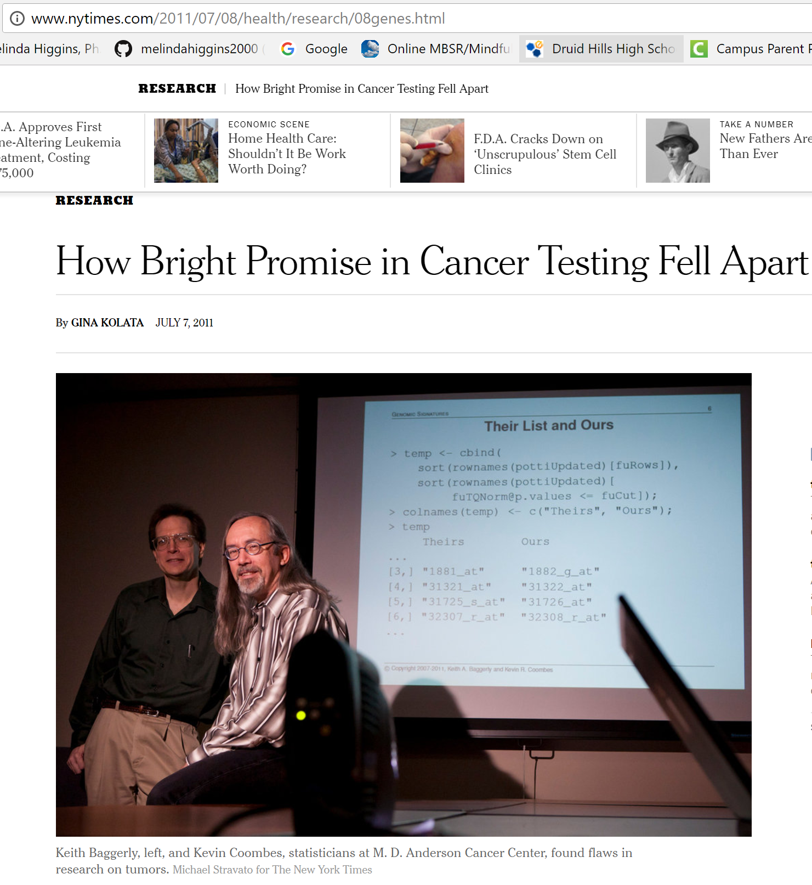
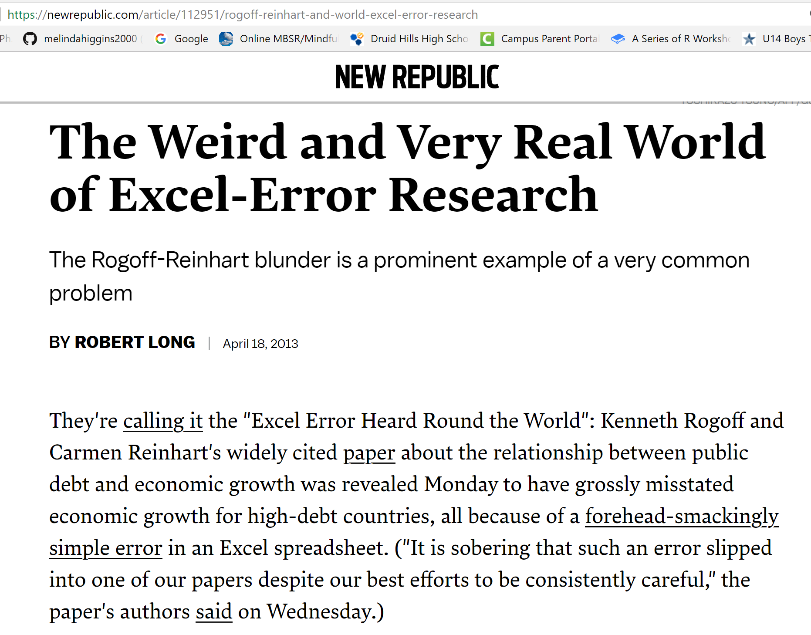
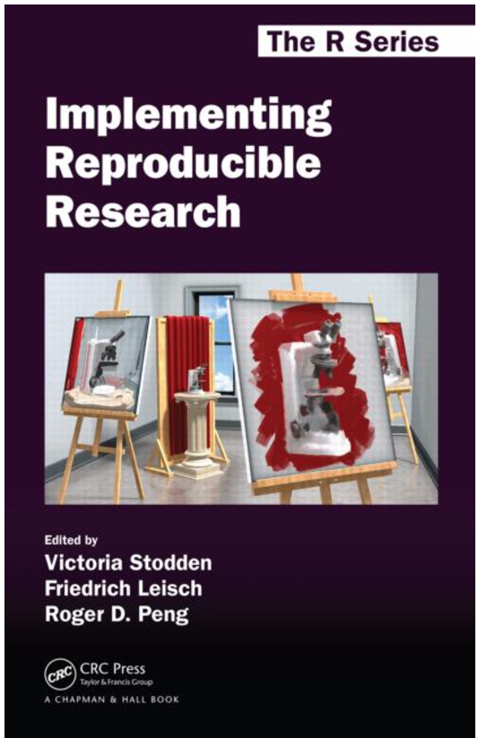

```{r setup, include=FALSE}
knitr::opts_chunk$set(echo = FALSE)
```

## Outline

* Timeline Reproducible Research & Transparency
* People
* Books
* Literate Programming > Dynamic Documentation > [R]Markdown
* The Big Picture

## Timeline Reproducible Research & Transparency<footnote>Timeline partially based on PLOS Blog December 2016[http://blogs.plos.org/absolutely-maybe/2016/12/05/reproducibility-crisis-timeline-milestones-in-tackling-research-reliability/](http://blogs.plos.org/absolutely-maybe/2016/12/05/reproducibility-crisis-timeline-milestones-in-tackling-research-reliability/)</footnote>

YEAR | Event
:----|:--------------------------------------
1992 | Jon Claerbout coined the term "reproducible research" in his book "EARTH SOUNDINGS ANALYSIS: Processing versus Inversion (PVI)" <footnote>[http://sepwww.stanford.edu/sep/jon/reproducible.html](http://sepwww.stanford.edu/sep/jon/reproducible.html)</footnote>
1996 | CONSORT statement introduced standards for reporting clinical trials <footnote>Begg C, Cho M, Eastwood S, Horton R, Moher D, Olkin I, Pitkin R, Rennie D, Schulz KF, Simel D, Stroup DF (1996). Improving the quality of reporting of randomized controlled trials. The CONSORT statement. JAMA 276:637-639.</footnote>
2004 | International Committee of Medical Journal Editors (ICMJE) stated they would not publish a clinical trial that had not been registered. <footnote>[http://www.icmje.org/news-and-editorials/update_2005.html](http://www.icmje.org/news-and-editorials/update_2005.html)</footnote>
2005 | Ioannidis, J. P. A. Why most published research findings are false. PLoS Med. 2, e124 (2005) <footnote>[https://doi.org/10.1371/journal.pmed.0020124](https://doi.org/10.1371/journal.pmed.0020124)</footnote>

## Timeline Reproducible Research & Transparency

YEAR | Event
:----|:--------------------------------------
2007 | FDA Amendments Act (FDAAA) required more types of clinical trials to be registered (final rules took effect January 2017) <footnote>[https://clinicaltrials.gov/ct2/manage-recs/fdaaa](https://clinicaltrials.gov/ct2/manage-recs/fdaaa)</footnote>
2009 | Journal of Biostatistics institutes policy to work with authors to publish articles that meet a standard of reproducibility.<footnote>[https://academic.oup.com/biostatistics/article/10/3/405/293660/Reproducible-research-and-Biostatistics](https://academic.oup.com/biostatistics/article/10/3/405/293660/Reproducible-research-and-Biostatistics) & [https://academic.oup.com/biostatistics/pages/General_Instructions](https://academic.oup.com/biostatistics/pages/General_Instructions)</footnote>
2011 | Alsheikh-Ali, et.al. (2011), report the low percentage of researchers satisfying the policies regarding the availability and sharing of their data.<footnote>Alsheikh-Ali, A. A., Qureshi, W., Al-Mallah, M. H. & Ioannidis, J. P. Public availability of published research data in high-impact journals. PloS ONE 6, e24357, 2011; [https://doi.org/10.1371/journal.pone.0024357](https://doi.org/10.1371/journal.pone.0024357)</footnote>

## Cancer Testing Falls Apart {.centered}

<div class="columns-2">




</div>
[http://www.nytimes.com/2011/07/08/health/research/08genes.html](http://www.nytimes.com/2011/07/08/health/research/08genes.html)

2010 Video Presentation by Keith A. Baggerly [http://videolectures.net/cancerbioinformatics2010_baggerly_irrh/](http://videolectures.net/cancerbioinformatics2010_baggerly_irrh/)

## The Excel-Error Heard Around the World {.centered}


[https://newrepublic.com/article/112951/rogoff-reinhart-and-world-excel-error-research](https://newrepublic.com/article/112951/rogoff-reinhart-and-world-excel-error-research)

## Timeline Reproducible Research & Transparency

YEAR | Event
:----|:--------------------------------------
2012 | Begley and Ellis reviewed 53 "landmark" studies and only 6 (11%) had the scientific findings confirmed.<footnote>[http://www.nature.com/nature/journal/v483/n7391/full/483531a.html](http://www.nature.com/nature/journal/v483/n7391/full/483531a.html)</footnote>
2013 | Center for Open Science launches & by 2014 the Open Science Framework has 7000 users with more than 45,000+ and over 15 institutions by 2017<footnote>[https://cos.io/about/brief-history-cos-2013-2017/](https://cos.io/about/brief-history-cos-2013-2017/) & [https://osf.io/](https://osf.io/)</footnote>
2014 | NIH publishes their guidelines for addressing reproducibility<footnote>[https://www.nih.gov/research-training/rigor-reproducibility](https://www.nih.gov/research-training/rigor-reproducibility)</footnote>
2015 | The Open Science Collaboration reports that they were only able to replicate between 1/3 to 1/2 of the results from 100 studies<footnote>Science, 28 Aug 2015: Vol. 349, Issue 6251, aac4716; DOI: 10.1126/science.aac4716; [http://science.sciencemag.org/content/349/6251/aac4716](http://science.sciencemag.org/content/349/6251/aac4716)</footnote>

## Wide-Spread Gene Name Errors {.centered}


[https://genomebiology.biomedcentral.com/articles/10.1186/s13059-016-1044-7](https://genomebiology.biomedcentral.com/articles/10.1186/s13059-016-1044-7)

## Wide-Spread Gene Name Errors {.centered}


[https://www.economist.com/blogs/graphicdetail/2016/09/daily-chart-3](https://www.economist.com/blogs/graphicdetail/2016/09/daily-chart-3)

## People

* Victoria Stodden [https://ischool.illinois.edu/people/faculty/vcs](https://ischool.illinois.edu/people/faculty/vcs)
    - presentation on History of the Reproducibility Movement [https://web.stanford.edu/~vcs/talks/ICERM-Dec102012STODDEN.pdf](https://web.stanford.edu/~vcs/talks/ICERM-Dec102012STODDEN.pdf)
    - co-author "Implementing Reproducible Research" book [https://www.crcpress.com/Implementing-Reproducible-Research/Stodden-Leisch-Peng/p/book/9781466561595](https://www.crcpress.com/Implementing-Reproducible-Research/Stodden-Leisch-Peng/p/book/9781466561595)
* Roger Peng [http://www.biostat.jhsph.edu/~rpeng/index.html](http://www.biostat.jhsph.edu/~rpeng/index.html)
    - Associate Editor for Reproducible Research - Biostatistics Journal [https://academic.oup.com/biostatistics/pages/Editorial_Board](https://academic.oup.com/biostatistics/pages/Editorial_Board)
    - co-author "Implementing Reproducible Research" book [https://www.crcpress.com/Implementing-Reproducible-Research/Stodden-Leisch-Peng/p/book/9781466561595](https://www.crcpress.com/Implementing-Reproducible-Research/Stodden-Leisch-Peng/p/book/9781466561595)

    
## People

* John P.A. Ioannidis [https://profiles.stanford.edu/john-ioannidis?tab=publications](https://profiles.stanford.edu/john-ioannidis?tab=publications)
    - Professor of Medicine and of Health Research and Policy at Stanford University School of Medicine and a Professor of Statistics at Stanford University School of Humanities and Sciences
* Christopher Gandrud [https://www.iq.harvard.edu/people/christopher-gandrud](https://www.iq.harvard.edu/people/christopher-gandrud)
    - research fellow at IQSS (Institute for Quantitative Social Science)
    - Book Author "Reproducible Research with R and RStudio" [https://www.crcpress.com/Reproducible-Research-with-R-and-R-Studio/Gandrud/p/book/9781466572843](https://www.crcpress.com/Reproducible-Research-with-R-and-R-Studio/Gandrud/p/book/9781466572843)
    
## People

* Yihui Xie
     - software engineer for RStudio[https://www.rstudio.com/about/](https://www.rstudio.com/about/)
     - author of "Dynamic Documents with R and knitr"[https://www.crcpress.com/Dynamic-Documents-with-R-and-knitr/Xie/p/book/9781482203530](https://www.crcpress.com/Dynamic-Documents-with-R-and-knitr/Xie/p/book/9781482203530)
     - author of "Bookdown: Authoring Books and Technical Documents with R Markdown" book [https://www.crcpress.com/bookdown-Authoring-Books-and-Technical-Documents-with-R-Markdown/Xie/p/book/9781138700109](https://www.crcpress.com/bookdown-Authoring-Books-and-Technical-Documents-with-R-Markdown/Xie/p/book/9781138700109) and `bookdown` R package [https://cran.r-project.org/web/packages/bookdown/index.html](https://cran.r-project.org/web/packages/bookdown/index.html)
     - author of `blogdown` R package [https://cran.r-project.org/web/packages/blogdown/index.html](https://cran.r-project.org/web/packages/blogdown/index.html)

## People

* Friedrich Leisch
     - Professor of Applied Statistics at the University of Natural Resources and Life Sciences, Vienna
     - developer of Sweave for creating dynamic reports [https://leisch.userweb.mwn.de/Sweave/](https://leisch.userweb.mwn.de/Sweave/)
     - co-author "Implementing Reproducible Research" book [https://www.crcpress.com/Implementing-Reproducible-Research/Stodden-Leisch-Peng/p/book/9781466561595](https://www.crcpress.com/Implementing-Reproducible-Research/Stodden-Leisch-Peng/p/book/9781466561595)


## Books on Reproducibility and Tools of the Trade {#myImagePage}

Image         | Book
:------------:|:--------------------------------------
 | Implementing Reproducible Research by Victoria Stodden, Friedrich Leisch, Roger D. Peng [https://www.crcpress.com/Implementing-Reproducible-Research/Stodden-Leisch-Peng/p/book/9781466561595](https://www.crcpress.com/Implementing-Reproducible-Research/Stodden-Leisch-Peng/p/book/9781466561595)
 | Dynamic Documents with R and knitr (Chapman & Hall/CRC The R Series) 1st Edition by Yihui Xie [https://www.crcpress.com/Dynamic-Documents-with-R-and-knitr/Xie/p/book/9781482203530](https://www.crcpress.com/Dynamic-Documents-with-R-and-knitr/Xie/p/book/9781482203530)
 | bookdown: Authoring Books and Technical Documents with R Markdown by Yihui Xie [https://www.crcpress.com/bookdown-Authoring-Books-and-Technical-Documents-with-R-Markdown/Xie/p/book/9781138700109](https://www.crcpress.com/bookdown-Authoring-Books-and-Technical-Documents-with-R-Markdown/Xie/p/book/9781138700109) & read online [https://bookdown.org/yihui/bookdown/](https://bookdown.org/yihui/bookdown/)

## more books {#myImagePage}

Image         | Book
:------------:|:--------------------------------------
 | Happy Git and GitHub for the useR by Jenny Bryan; read online [http://happygitwithr.com/](http://happygitwithr.com/)
 | Using R and RStudio for Data Management, Statistical Analysis, and Graphics, Second Edition by Nicholas J. Horton &  Ken Kleinman [https://www.crcpress.com/Using-R-and-RStudio-for-Data-Management-Statistical-Analysis-and-Graphics/Horton-Kleinman/p/book/9781482237368](https://www.crcpress.com/Using-R-and-RStudio-for-Data-Management-Statistical-Analysis-and-Graphics/Horton-Kleinman/p/book/9781482237368); also see [Project MOSAIC, http://mosaic-web.org/](http://mosaic-web.org/)
 &  | ModernDive: An Introduction to Statistical and Data Sciences via R by Chester Ismay and Albert Y. Kim; read online [https://ismayc.github.io/moderndiver-book/](https://ismayc.github.io/moderndiver-book/) & Getting used to R, RStudio, and R Markdown by Chester Ismay [https://ismayc.github.io/rbasics-book/](https://ismayc.github.io/rbasics-book/)
.              | ... and lots more ... see [https://bookdown.org/](https://bookdown.org/)

## Literate Programming > Dynamic Documentation > [R]Markdown

YEAR | Event
:----|:--------------------------------------------------------------
1992 | "Literate Programming" is introduced by Donald Knuth as "that (which) combines a programming language with a documentation language, thereby making programs more robust, more portable, more easily maintained, and arguably more fun to write than programs that are written only in a high-level language. **The main idea is to treat a program as a piece of literature, addressed to human beings rather than to a computer.**" [http://www-cs-faculty.stanford.edu/~knuth/lp.html](http://www-cs-faculty.stanford.edu/~knuth/lp.html)
2002 | Friedrich Leisch introduces `SWEAVE` a program for "Dynamic generation of statistical reports using literate data analysis" [https://leisch.userweb.mwn.de/Sweave/](https://leisch.userweb.mwn.de/Sweave/)

## Literate Programming > Dynamic Documentation > [R]Markdown

YEAR | Event
:----|:--------------------------------------------------------------
2004 | John Gruber created the `Markdown` language in 2004 in collaboration with Aaron Swartz - their goal was to "write using an easy-to-read, easy-to-write plain text format, and optionally convert it to structurally valid XHTML (or HTML)" [https://daringfireball.net/projects/markdown/](https://daringfireball.net/projects/markdown/)
2012 | Yihui Xie releases `knitr` R package released - `knitr` was inspired by `SWEAVE`
2014 | `rmarkdown` R package released - extends `Markdown` to work with R/RStudio environment

## The Big Picture {#bigpic}


## The Big Picture {#bigpic}


## The Big Picture {#bigpic}


## The Big Picture {#bigpic}


## The Big Picture {#bigpic}


## Next in Lesson 02 ... {.flexbox .vcenter}

Literate Programming 

& 

Dynamic Documentation
