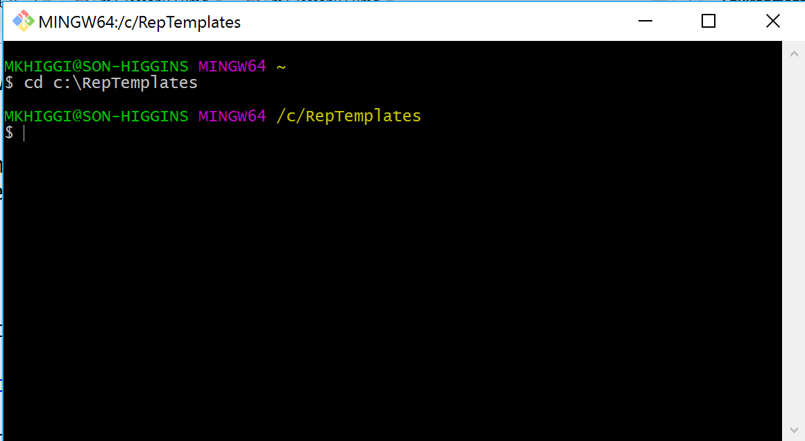
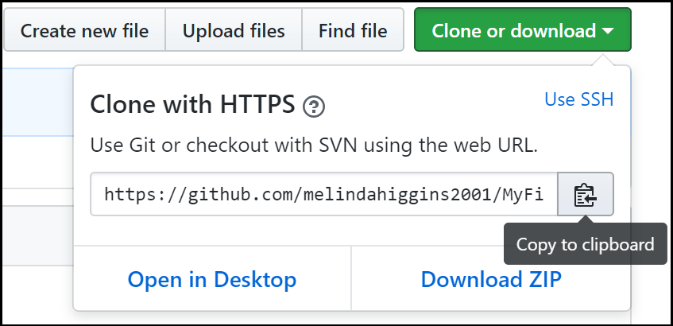

```{r setup, include=FALSE}
knitr::opts_chunk$set(echo = FALSE)
```

## Lesson 06 ... {.flexbox .vcenter}

<div style="font-size:200%">
Getting Started with
</div>

<p>  </p>


**Github**

& 


##  What is Github??

* [https://github.com/](https://github.com/)

**Github** is web-based **GIT** repository hosting service. It offers all of the distributed revision control and source code management (SCM) functionality of Git as well as adding its own features - for example, native interpretation of [*markdown*](https://daringfireball.net/projects/markdown/) which is MUCH easier to code/write than HTML - very lightweight code for creating documents.

**Github**, unlike Git, which is strictly a command-line tool, GitHub provides a Web-based graphical interface and desktop as well as mobile integration. **Github** provides access control and collaboration features such as bug tracking, feature requests, task management, and wikis for every project.

## Setting up your own Github Account

Go to [https://github.com/](https://github.com/)

1. Pick a Good Username for Your Github Account
    - Pick something that is professional and represents you.
    - This will be your identity on Github and will be viewable to everyone.
    - _NOTE: For this course, I assume that you are creating a PUBLIC Github account, which is FREE. You can create a PRIVATE Github account for a fee._

2. You can register one Github account per email.

3. Once you get logged in to your Github Account, go to your account settings to customize your bio, email, website URL, and more...

4. When you first get started you won't have any repositories, but we will be creating repositories for each project.

## Github Settings


_...next let's install Git..._

##  What is GIT??

* [https://git-scm.com/](https://git-scm.com/)

**GIT** is a widely used source code management system for software development. It was designed and developed in 2005 by Linux kernel developers (e.g. Linus Torvalds) for Linux kernel development. 

**GIT** is a distributed version control system with complete history & version-tracking capabilities. [Other version control systems you may have heard of are Subversion, CVS, Perforce, and ClearCase] 

**GIT** is FREE & distributed under the terms of the GNU General Public License version 2. More @  [https://git-scm.com/](https://git-scm.com/)

## Download and install Git

* Go to [https://git-scm.com/](https://git-scm.com/) - click "Downloads"
* Pick the download link for your operating system - **NOTE** Clicking these links starts the file download.
* Next install Git, follow the instructions and accept the defaults.

## Let's test your Git and Github setup

1. Open your browser and log into your Github account
2. Click on your Profile, and then Click on Repositories
3. Click NEW to create a new repository.
    - type in a name for your repository such as "MyFirstRepo"
    - put in a short description like "My First Github Repository"
    - Go ahead and click the box to select "Initialize this repository with a README"
    - keep everything else the same (use the default)
    - click "Create Repository"

## Github - "My First Repo"


## Github - "My First Repo"


## Now let's connect using Git

1. Create a directory on your local drive where you want to save copies of your Github repositories for this course.
    - For example, create a directory "RepTemplates" on your "C" drive, for example `C:\RepTemplates`
2. Find where Git was installed on your computer. There are 3 options for running Git:
    - "Git Bash" - we will use this one
    - "Git CMD"
    - "Git GUI"
3. Run the "Git Bash" option - This opens another window
4. Change to your newly created directory by typing `cd C:\RepTemplates`

## Git Bash Window



## Happy Git and Github for the useR

To get more information about the Git commands we're using and getting connected to your Github account, we will refer to the  details provided in the "Happy Git and GitHub for the useR" book by Jenny Bryan. It is available online for FREE at [http://happygitwithr.com/](http://happygitwithr.com/)

Read these chapters:

* Chapter 8: "Introduce Yourself to Git"
* Chapter 10: "Connect to Github"

## Introduce yourself to Git

First, introduce yourself to Git - type the following 3 commands in your Git Bash window. Put in your name and email you used to set up your Github account. Be sure you are logged into Github.

```
git config --global user.name 'Jennifer Bryan'
git config --global user.email 'jenny@stat.ubc.ca'
git config --global --list
```

Keep your Git Bash window open.

## Connect to your Github repo

Next we'll connect to Github and PULL a copy of your new repository "MyFirstRepo" to your local drive `C:\RepTemplates`

In your Git Bash Window you will use the `git clone` command. However, you also need the URL address for the repository. The easiest way to look this up is to go back to your Github account, click on the "MyFirstRepo" repository. Then click on the green button to "Clone or Download" to see the URL, then click the button on the right to "Copy the URL to the clipboard"



## Git Bash command

In the Bit Bash window, type the git commands listed below - Be sure to use YOUR URL to YOUR Github Repo "MyFirstRepo".

If everything works fine, when you first type `ls` which "lists" the content of the directory, you should see that a new directory is created for your new repository `MyFirstRepo/`

Then you can `cd` "change directory" to `MyFirstRepo` and run `ls` again to see the one file in your repository `README.cd`.

```
git clone https://github.com/YOUR-USERNAME/MyFirstRepo.git
ls
cd MyFirstRepo
ls
```

## Git Bash - Example Cloning


Congratulations!! You are now connected to Github with Version Control using Git.

## Next in Lesson 07 ... {.flexbox .vcenter}

Create your first reproducible `rmarkdown` document!


